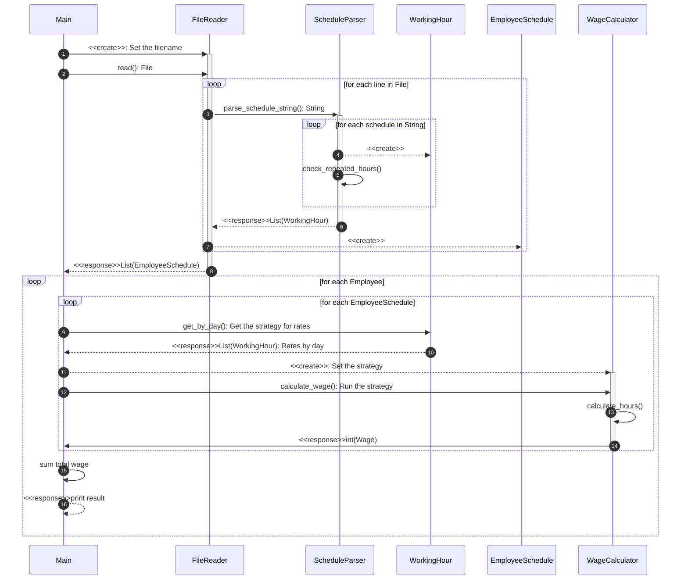

# Wage Calculator - Coding Exercise

This program calculates the total that the company has to pay an employee, based on the hours they worked and the times during which they worked.

- **Rules**:
	- Cannot use any external library to solve the exercise, however you can add any dependency for testing purposes.
	- Use of dependencies that come with the standard library of a programming language are allowed.
	- The program must calculate the wage based on the day of the week and time of day, according to specific parametrization.
	- The following abbreviations will be used for entering data: `MO: Monday, TU: Tuesday, WE: Wednesday, TH: Thursday, FR: Friday, SA: Saturday, SU: Sunday`

	- **Input:** 
		- The name of an employee and the schedule they worked, indicating the time and hours. This should be a .txt file with at least five sets of data.
		- Each line of the file has the following structure for example: 
			- `RENE=MO10:00-12:00,TU10:00-12:00,TH01:00-03:00,SA14:00-18:00,SU20:00-21:00`
			- `ASTRID=MO10:00-12:00,TH12:00-14:00,SU20:00-21:00`
	- **Output:**
		-  Indicate how much the employee has to be paid
		- The output has the following structure for example:
			- `The amount to pay RENE is: 215 USD`
			- `The amount to pay ASTRID is: 85 USD` 
# Install

```
    # clone the repository
    $ git clone https://github.com/EjacDev/WageCalculator
    $ cd WageCalculator
```

## Tests
Create a virtualenv and activate it:

    $ python3 -m venv venv
    $ . venv/bin/activate

Or on Windows cmd:

    $ py -3 -m venv venv
    $ venv\Scripts\activate.bat
**The required packages are only for testing purposes**
`$ pip install -r requirements.txt`

Execute the tests
`$ pytest`

Run with coverage report:
```
$ coverage run -m pytest
$ coverage report
$ coverage html  # open htmlcov/index.html in a browser
```
Final coverage result

|Name|Stmts|Miss|Branch|BrPart|Cover
|-|-|-|-|-|-
|app/__init__.py|3|0|0|0|100%
|app/calculator.py|30|0|12|0|100%
|app/filereader.py|57|0|18|0|100%
|app/models.py|24|0|4|0|100%
|app/run.py|21|0|8|0|100%
|**TOTAL**|**135**|**0**|**42**|**0**|**100%**

## Run
Print the usage help
`$ python3 main.py -h`
    
Running with default file 'data.txt'
`$ python3 main.py`

Running with a custom file 
`$ python3 main.py --filename 'FILENAME.txt'`


# Overview of the solution
## Architecture

To develop the solution I used object-oriented programming, since I was looking for a solution that was easy to understand, flexible and parameterizable, so I created objects like `WorkingHour` that represents a block of time for a specific day and with a rate value , which allows to parameterize the rates within those objects or also to be able to read the values from an external database.

Also create the `Employee` and `EmployeeSchedule` objects that represent an employee, and an employee with a working schedule, where the working schedule uses the same `WorkingHour` object to store the data that is read from the file.

The code is developed applying good OOP practices, and SOLID principles, seeking to separate responsibilities, and make the code scalable and extensible.
I applied the "Strategy" design pattern, where I defined different strategies to calculate the payout corresponding to a range of time according to the day, and a `WageCalculator` class is used to encapsulate that logic and allow strategies to be easily interchanged.

Thanks to this design pattern, it is possible to change the rates for each day in a simple way, without affecting the rest of the code, and the possibility of extending the functions to add, for example, the role or position of the employee and different rates.

## Approach

These are some of the validations that were added and tested to the application to avoid problems and errors with the data:
- File format: Only .txt files are supported
- File not exists
- Invalid separators in the file
- Invalid employee names
- Invalid day
- Invalid time formats
- Coherence between the start and end time for the schedule
- Duplicated working hours

Here are some considerations I took into account in development:
- The rate table is stored as a list of objects, so it is possible to easily modify it or read it from another source.
- The hour `00:00` represents `24:00`, because the hour 24 is not allowed in time format, for example between `20:00` and `00:00` there are `4` hours.
- The initial time of each block starts at `00:00` and not at `00:01`, since that missing second is required to calculate the complete hour, like this:
```python
weekday_time_blocks = [
	WorkingHour(day, datetime.time(0, 0), datetime.time(9, 0), 25),
	WorkingHour(day, datetime.time(9, 0), datetime.time(18, 0), 15),
	WorkingHour(day, datetime.time(18, 0), datetime.time(0, 0), 20)
]
```
- The `Employee` and `EmployeeSchedule` objects are different classes, allowing them to be scalable objects.

## Methodology
Following the best practices of OOP, the tests correspond to each of the functions for each class, tests were also added to verify cases with erroneous data and their errors, once the development of the code was finished, I completed the tests with a coverage of 100 %.
The following diagram shows the code flow through the different classes, evidencing the independence of functions, the simplicity and the flexibility of the code.

